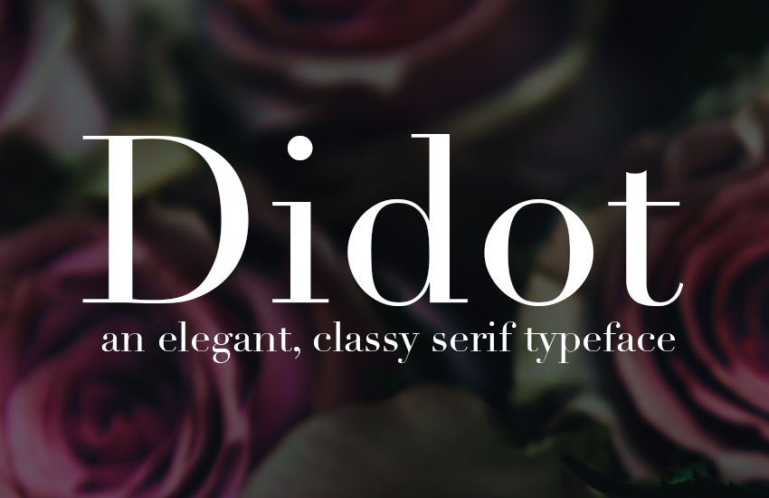

Regarding print media, it has always been known that fashion magazines have been greatly appreciated for their stunning covers, classic layouts and their luxury ads. Typography plays an essential role in a magazines development since it can identify the genre and the target demographic which ultimately captures the attention of the desired audience. 

*'A choice of font is what makes a great fashion magazine.*

Vogue is arguably one of, if not the most influential fashion magazines of all time, becoming a global phenomenon all thanks to Anna Wintour's 1988 transformation. But the question is, what has made it so successful?

In order to dominate the industry, a magazine needs to be iconic and recognisable worldwide. Vogue was able to exceed the expectations of its competitors with the clever use of typography. The first words that come to mind when we think about Vogue is luxury and sophistication; this is all because of its iconic Didot font. 

It has had a major role in generating its success.