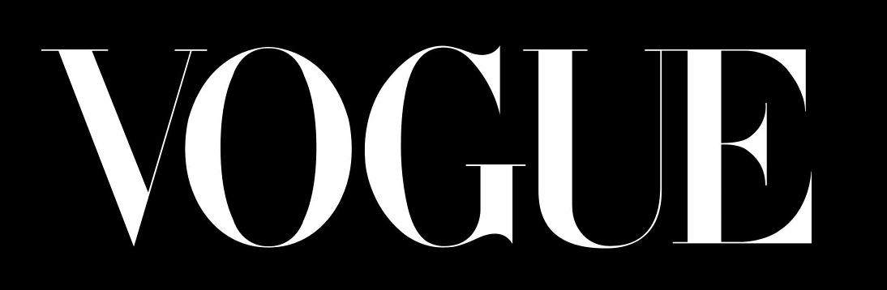

Regarding print media, it has always been known that fashion magazines have been greatly appreciated for their stunning covers, classic layouts and their luxury ads. Typography plays an essential role in a magazines development since it can identify the genre and the target demographic which ultimately captures the attention of the desired audience. 

> *'A choice of font is what makes a great fashion magazine.'*

Vogue is arguably one of, if not the most influential fashion magazines of all time, becoming a global phenomenon all thanks to Anna Wintour's 1988 transformation. But the question is, what has made it so successful?

In order to dominate the industry, a magazine needs to be iconic and recognisable worldwide. Vogue was able to exceed the expectations of its competitors with the clever use of typography. The colours, content, and models may change, but Vogue has a consistent look on each of its variations. This consistency has contributed to the brands success because it is a now such a distinguishable and iconic identity.

***Masthead:*** 

The typography used in Vogue has had a major role in generating its success because of the consistency of the serif font, 'Didot'. Didot was established in 1974 and the typeface takes inspiration from John Baskerville's experimentation with increasing stroke contrast and a more condensed armature. *[(https://en.wikipedia.org/wiki/Didot_(typeface)](https://en.wikipedia.org/wiki/Didot_(typeface)).* It comes from the french word meaning 'Style' and creates just that on the monthly editions. 

The first words that come to mind when we think of Vogue are luxury and sophistication; this is all because of the high contrast, thick and thin lines used within the typeface. Didot's timeless look is a result of the mixture between its classic, sleek yet modern feel. It’s bold lettering, usually accompanied by an A-list celebrity, is what draws its audience in and emphasises the feeling of true opulence.

***Subheadings:***

The fonts used for Vogue’s subheadings can be serif as well, which reiterates the crisp and professional sense we get as readers from the brand. However, on some issues there is a combination of both sans and serif typefaces and this is what gives Vogue it's timeless feel - There's always going to be that perfect blend of classic and modern touches.

The main subheadings are usually regular/heavier in weight and bold against the background which allows for the reader’s attention to be seized. This juxtaposes the lower contrast of the secondary information provided, which is often lighter in weight and colour and overall conveyed more subtly. 

Since Vogue's target demographic is women, we are able to identify as readers the feminine characteristics used in the brands typography that have been included to appeal to this group. The neutral tones radiate a light and airy feel and reiterates the feeling of professionalism and luxe. 

