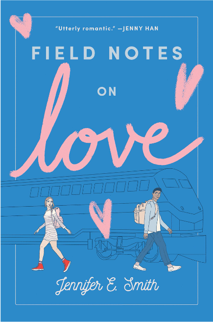
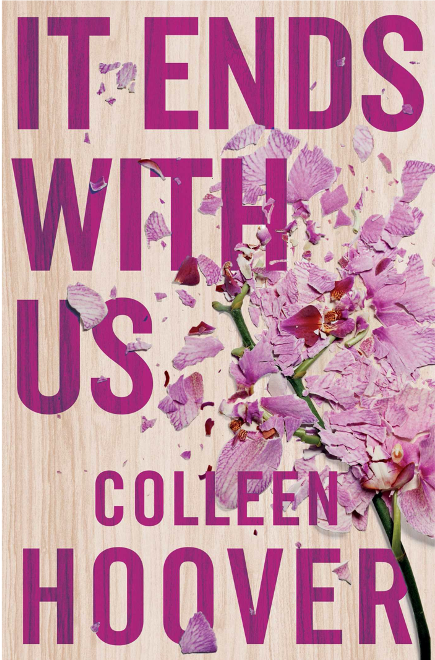

It’s important when a book is not only a captivating read but also an eye-grabbing beauty that people want to put on a shelf to enjoy the view every day. Romance is one of the most popular fiction genres and one of the most profitable, making approximately $1.44 billion a year in sales. 

> *"Type can generate its own meanings and connotations - it is in essence a form of expression."* - Target Ink

***How is the romance genre disclosed by the covers above?***

* Sans-serif typefaces particularly presented in handwriting form.
* Images of couples - Man & Woman or same sex. 
* Love hearts
* Simple backgrounds that don't take away from the main features of typography.

***What type of font is commonly used in romance novels?***

Whether it’s a classic Austen re-print or a contemporary teen romance, you want to find a typeface with femininity and elegance in abundance. *Sabon* is a 1960s update on Claude Garamond’s design.

This serif is simple and clear, while retaining a definite touch of grown-up tone. You can’t go wrong with setting a romantic epic in *Sabon*.

### ***Colour:***

The most popular colours used within the romance genre are red and pink because as it's explained above, they both are used to symbolise the emotion of love. There is a difference between them, however, that may be used by designers to indicate what type of approach the author is taking with the idea of romance in mind:

Pink: Softer and more delicate. May be used in young adult fiction. 

Red: Exploration of passion and perhaps erotica with the colours strong link to sexuality. May be used primarily in adult fiction. 

### ***Field Notes On Love, Jennifer E. Smith***

It's common for typography within the romance genre to follow a similar prospect of design. The display font chosen for the cover of 'Field Notes on Love' uses the typeface ‘*handwriting’,* this gives the impression that someone has written it themselves which creates a personalised feel. The designer is keen on connecting the reader with the storyline. 

By enlarging the lettering of the word 'love' and using the colour pink, the audience are already prepositioned to associate the book with the romance genre even before picking it up or reading the blurb.

A mixture of fonts have been used on the cover all of which are common within the romance genre.

### *It Ends With Us, Colleen Hoover*

Again, with Colleen Hoover's, It Ends With Us, the typography used helps the audience associate the book with its genre. The colour pink connotes the feeling of comfort and compassion and even informs us that the story may be following a female lead.

The background colour is plain and light; overall being neutral and contrasting with the darker and capitalised sans-serif typeface which is where the importance is held.  

Another representation of romance present on the cover is the pink flowers which can be associated with youth, beauty, and pleasure as well as a token of appreciation in love.