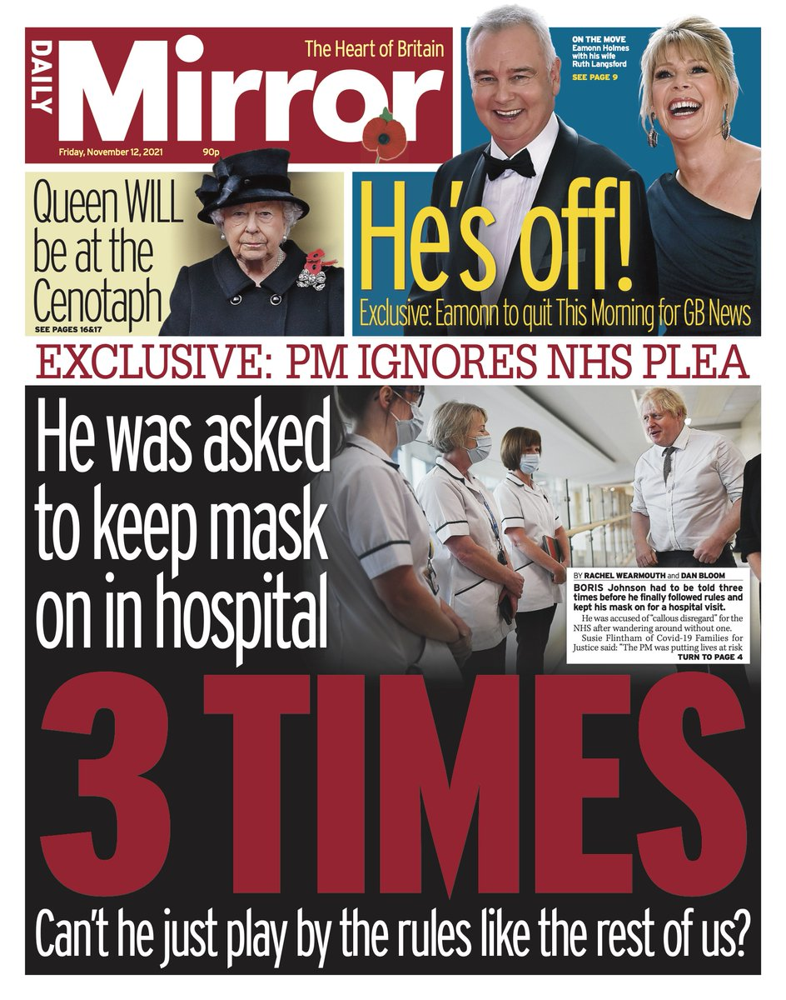

Newspaper typography is a vital factor when portraying the correct ideology and representation that newspapers want to demonstrate for their demographic audiences. The typefaces chosen creates the brand of the newspaper as it targets audiences, ideas and beliefs.

Looking at two newspapers which are on opposite ends of the spectrum; *The Guardian* and *The Sun*, it becomes evident that typography plays a powerful role in the construction of print media and it is what is recognised by millions for their individual reputation.

Text: The majority of all body text in newspapers is serif type, with most papers using one of four or five basic faces. Research has shown that it takes slightly longer to read sans serif type, and serif type is more visually pleasing to the eye. A heavy typeface should be used in order to contrast the black text with the grey paper. Hairline elements of a typeface should be avoided because the print quality of newspapers is low, and parts of letters could disappear if they’re too faint. The face should be a bit narrower than regular type in order to save space.

Headlines: Headline type is the most dominant typographic element on the page. Headlines should be chosen to reflect the overall personality of the paper. Both serif and sans serif type are used for headlines. However, serif faces are seen to be more expressive and less impersonal.

Masthead: Most newspapers are identified by their masthead. When people look at a newspaper, the first thing they see is the nameplate. In England, the most popular masthead is in Old English style.

