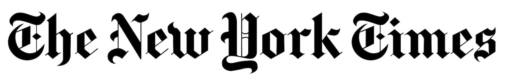
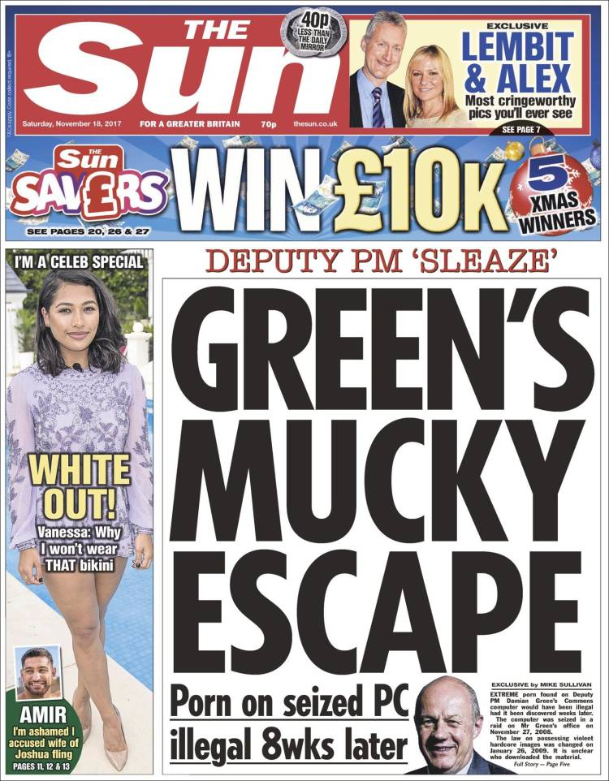
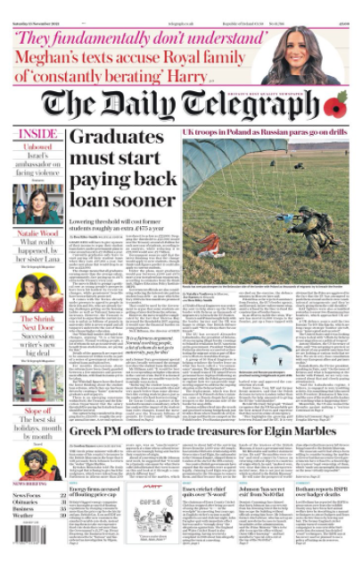

Illustrating accurate ideologies is a fundamental factor in newspaper publishing, and choosing the correct forms of typography can help the brand appeal to their target demographic. 

### ***Masthead:*** 

Most newspapers are identified by their masthead. In England and now America, the most popular masthead is in Blackletter (also called the Old English style) which is a very heavy and low contrasted font. 

### *Headlines:*

The newspapers headline is the most dominant typographic element on the page. Headlines should be chosen to reflect the overall personality of the paper. Both serif and sans serif type are used for headlines. However, serif typefaces are generally more expressive and emanate a professional tone.

### *Text:*

The majority of body text in newspapers are serif type, with most papers using one of four or five basic faces: Poynter, Utopia, Times New Roman, Century Old Style and Nimrod. Research has shown that it takes slightly longer to read sans serif typefaces, and serif type is more visually pleasing to the eye. 

A heavy typeface is often used in order to contrast the black text with the grey paper.

### *Tabloids Vs Broadsheets*

Looking at two newspapers which are on opposite ends of the spectrum; *The Guardian* and *The Sun*, it becomes evident that typography plays a powerful role in the construction of print media and it is what is recognised by millions for their individual reputation.

Most tabloids use a sans serif type, and The Sun is no different using the 'Franklin Gothic Bold' font. 

Most broadsheets tend to use serif typefaces.