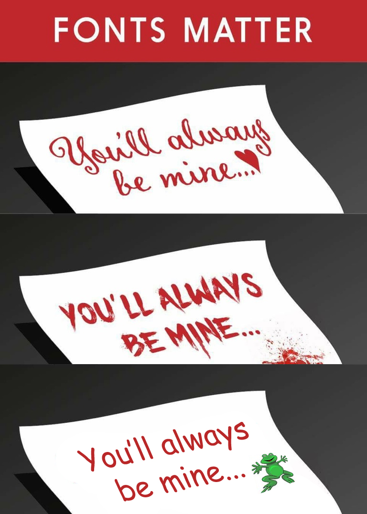
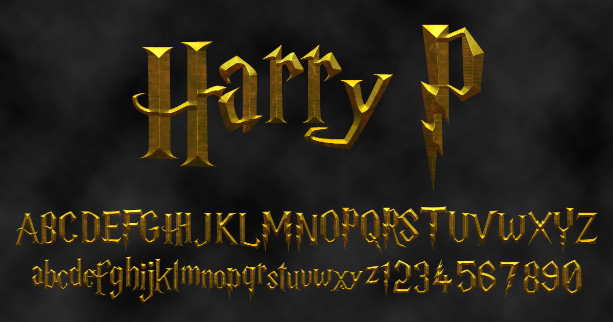

Type is all around us and it has this amazing ability to help us decide whether we like or dislike something, whether we want to buy an item being advertised, or even to pick up a book of movie just by looking at the cover.

> *'Typography is the art and technique of arranging type to make written language legible, readable and appealing when displayed. The arrangement of type involves selecting typefaces, point sizes, line lengths, line-spacing, and letter-spacing, and adjusting the space between pairs of letters.'*

Often as human beings, we are constantly analysing the power of a written word, but rarely do we consider the designer’s role in emulating the tone of a word or sentence. A creator will take into consideration aesthetics, the genre of their piece, demographics and be able to select the perfect weighted font, enriched with the right colours and feelings to create an attractive and valued design.

Take the Harry Potter book and film series for example. The global phenomenon is well known for its striking illustrated covers, posters and metallic text, and this is because artist Graham Meade designing the ‘Harry P’ font. The reason why the typeface is so famous is because of the consistency throughout the eight films and the US editions of the books.

Harry P is the earliest and most popular recreation of the Harry Potter film logo, which is itself inspired by Mary GrandPre's original American book cover. The use of typography is important regarding this series because of the thought that went into accurately symbolising Harry's scar with the 'P' for Potter. It's weighted, bold and eye-catching compared to the sub-titles which usually emit a softer tone. 

The typography for the series overall was well thought out and designed with the story in mind. The Harry P font is now so recognisable that it's been used for merchandise, advertisements and even shop fronts.

