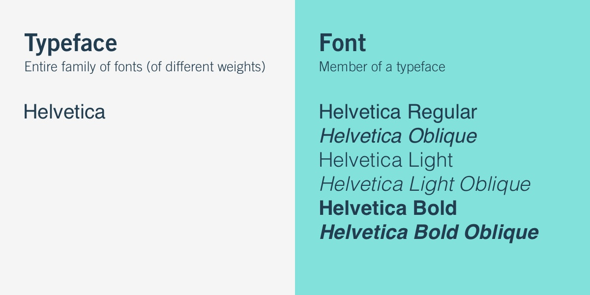

Type is all around us and it has this amazing ability to help us decide whether we like or dislike something, whether we want to buy an item being advertised, or even to pick up a book of movie just by looking at the cover.

Often as human beings, we are constantly analysing the power of a written word, but rarely do we consider the designer’s role in emulating the tone of a word or sentence. A creator will take into consideration aesthetics, the genre of their piece, demographics and be able to select the perfect weighted font, enriched with the right colours and feelings to create an attractive and valued design.

Take the Harry Potter film series for example. The global phenomenon is well known for its striking illustrated posters and metallic text, and this is because artist Graham Meade designing the font ‘Harry P’. The reason why the font has been so popular is because of the consistency throughout the eight films.

> *Typography is the art and technique of arranging type to make written language legible, readable and appealing when displayed. The arrangement of type involves selecting typefaces, point sizes, line lengths, line-spacing, and letter-spacing, and adjusting the space between pairs of letters.*