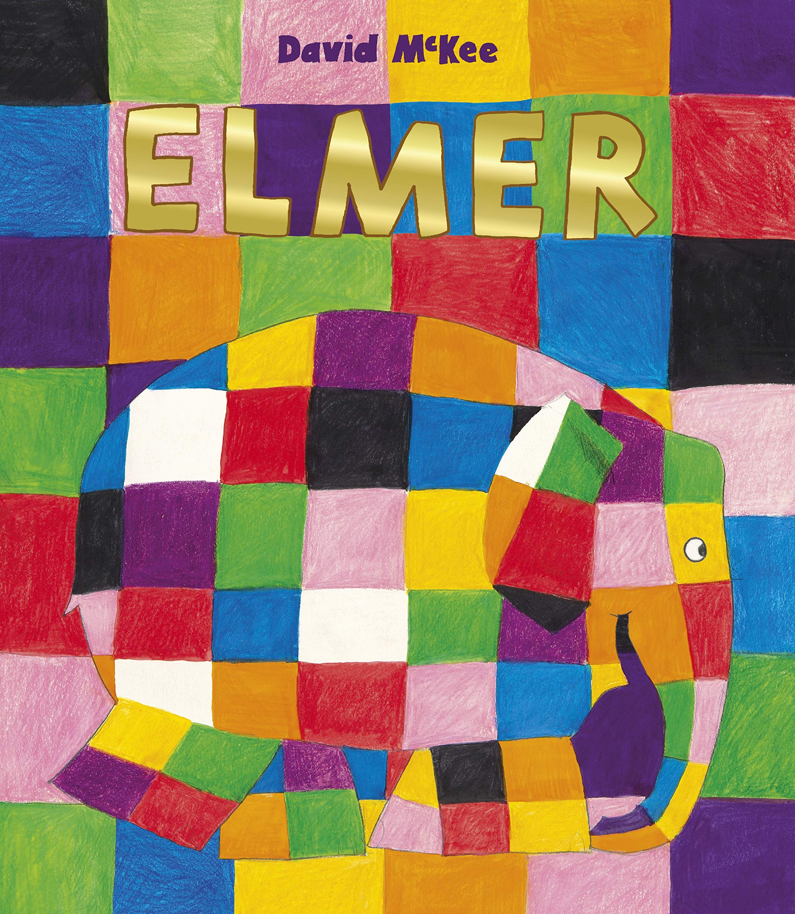
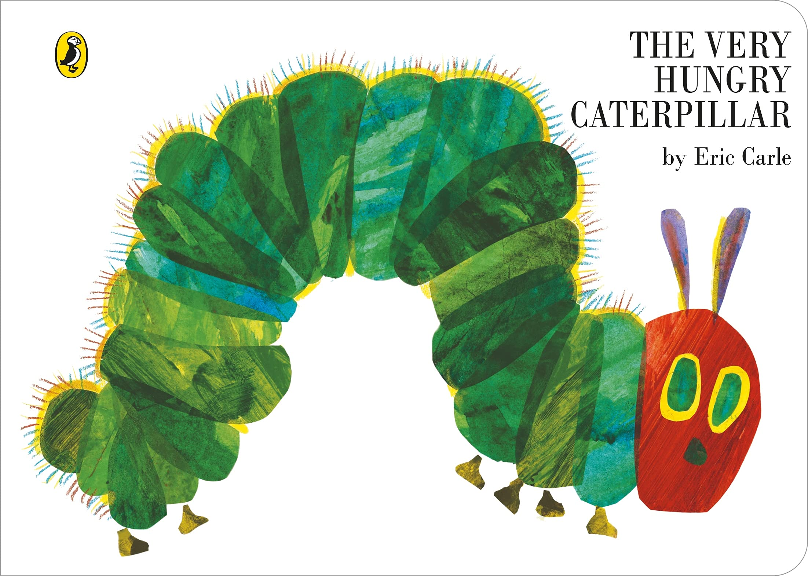

Books are an especially important part of learning for children and this is why using the right typography on the front cover and inside the books is one of the most important aspects regarding initiating its success. In order for young people to engage with a novel, the typography must be appealing in order to assist with their development.

Type colour, or colour, is an element of typography that describes how dense or heavy the text appears on the page. Finding the correct balance of type colour and white space can make text more easily readable which is fundamental concerning children.

To provide stimulation for growing minds, colour must be used right in children's books to help draw them into the visual aspects that the various colourful aspects are promoting. Colour provides a powerful way of learning about the world. For a child, there is little that is more important than facilitating a love of learning. The presence of colour in children’s books invites them to explore the visual spectrum of the world around them and to learn about it in an engaging and memorable way.

When bright/bold colours and text are used in children’s books, they are more likely to start connecting what they see in the books with what they see in real life. The vividness holds interest and encourage the young minds to start making associations that will become the building blocks for later learning.

The cover is embedded with so much colour and a shiny gold sans serif font which is appealing for young minds who can't usually focus well in finer and denser writing. 

Elmer the Patchwork Elephant is a great example of the difference between the typography regarding children's publishing and adult. Above we see Elmer is written in a low contrast and heavy weighted font which is easier for younger audiences to read and distinguish in relation to the books main character. The title is also presented in a modern way which may help the books success with children who are prepositioned to enjoy new and shiny things. 

*According to librarians and children's-literature experts, 'The Very Hungry Caterpillar's success is attributed to its effortless fusion of story and educational concepts, its striking visual style, and the timelessness of both its aesthetic and its content.' - The Atlantic*

Comparing this to Elmer the Patchwork Elephant, however, a serif font is used for the title which is uncommon in children's books. The serif font is primarily used to promote a more adult and sophisitcated tone, so it's interesting that it's become one of the most famous pieces of children's literature. On some book covers, the text takes a backseat and 

From looking at the layout and typography of Elmer the Patchwork Elephant and various other children’s books it is clear from the large format, type size and white space with heavy illustrations that a younger audience is the target demographic, compared to smaller fonts with compact text is for older readers.