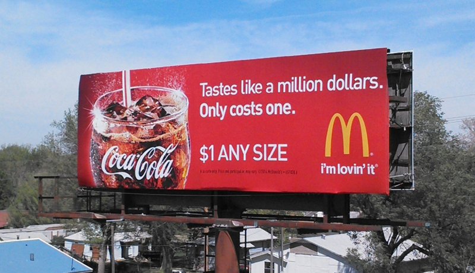

In the age of multi-channel advertising, choosing the right typography for outdoor advertising can be tricky. A typeface that works for large, outdoor billboards won’t necessarily work on a transit poster but they both do need to consist of a typeface that's legible from a distance.

No matter how compelling the advertisement is, if those viewing the content can’t read it, it will be dismissed without a second look. Designers have approximately three to six seconds to make the content count.

Sans-Serif fonts tend to work best for content on outdoor displays as they are the easiest to read at a glance. In particular, Arial (28 percent), Helvetica (20 percent), Verdana (8 percent) and Open Sans are used and are the most legible according to research done by *Rise Vision*.

A larger font will allow people to read content from a distance, engaging them at an earlier point as they approach the display. Big fonts will also take up more space on the display, minimising the amount of text you use, whilst still increasing the impact of your message. 

Most designers will insist on short, punchy lines in larger font sizes, rather than a long body of text in small print otherwise the point will be overshadowed by the image.

The McDonald's billboard advertisement here has been designed in a way, not only to entice audiences but to promote the companies brand altogether. McDonald's is known for it's prime colours (bold red background and yellow text), and the typography used on their billboard advertisements effectively informs the audience instantly what it is marketing. 

The current 'Golden Arches logo' was introduced in 1968, resembling an "M" for "McDonald's" and it is widely regarded to be one of the most recognizable logos in the world. When advertising a company on a billboard it's important to reference the brands original typography. In Mcdonald's case, including the golden arch alone will do its job at promoting but using the iconic bold red background is just as significant. It needs to be readable for both pedestrians and those in vehicles. 

Similarly to stated above, transit advertisements need to be bold enough so that when the vehicle is in motion, it's still legible. Thin and fancy fonts are difficult to read from long distances at high or medium speeds therefore sans serif fonts are used. They are simple, modern and easily intelligible therefore is the perfect typography choice for effective transit designs.