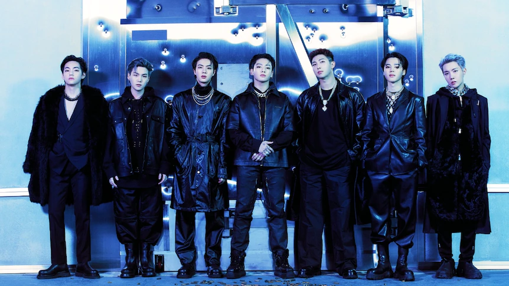
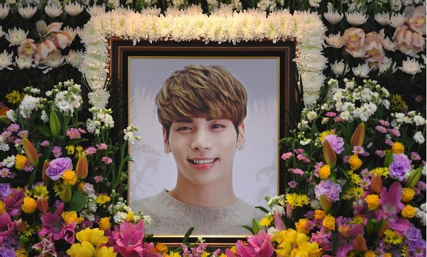
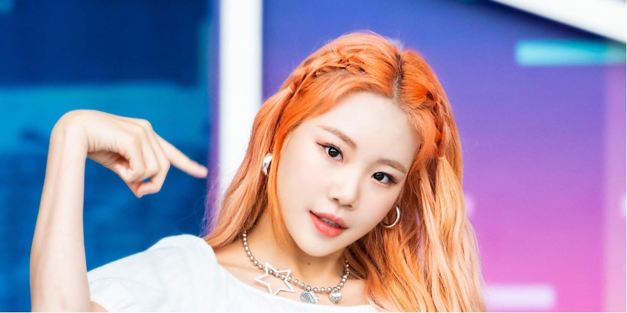

The year is 2017, and popular boy group BTS has just had their debut on major American television; being the first Korean act to perform on the American Music Awards. Since then, K-pop has taken the world by storm, introducing western audiences to the Korean music industry’s catchy tunes, impressively choreographed dance routines, and unprecedented work ethic that all idols are expected to bring to the table. However, though there are so many amazing qualities regarding the Korean entertainment industry; there is also a depressing reality lingering behind the exuberant facade artists that companies are presenting to their audiences. It’s becoming impossible to ignore as the society’s strict beauty standards (that idols must meet to be considered successful) are having a harmful effect on their wellbeing.

The Korean society and their intense standards have recently become a hot topic after idol Ahn Hye-jin, better known as her stage name Hwasa, decided to speak up against the country’s narrow definition of beauty. Ahn simply stated, "If I don't fit today's beauty standards, I'll become a new, different standard.” Before we uncover the pressure of the entertainment industry, we must understand South Korea’s most sought-after ideals for women. A slim figure and small face are prioritised along with pale and flawless skin, a V-shaped jaw, double eyelids, and a nose with a thin bridge. These are just a few of the many requirements the society encourages its citizens to have in order to be deemed attractive. Hwasa, though celebrated for being a model for female empowerment and praised for her incredible talent and work ethic, has also struggled since her debut in 2014 with comments on her appearance. She has been relentlessly shamed for her body by netizens and even entertainment companies, revealing to fans that she was once called “fat and not pretty” by a manager. This is where the problem lies; it’s not enough to just be talented in South Korea, idols must also look a certain way to be recognised in the industry. It seems beauty is more than often used to measure the value of a person, and this has had some pretty harmful effects on idols willing to do *anything* to make it to the big leagues.

***So what is the reality behind the catchy lyrics, killer moves and fabulous costumes?***

**Eating disorders and suicides.** Body shaming has become a serious issue faced by most K-pop celebrities; causing the majority of them to undergo unhealthy diets and gruelling workouts just to stay in peak condition. Though male idols are encouraged to keep up a healthy image, it seems the industry and media focus primarily on female artists. On an episode of SBS’ *Healing Camp, Aren’t You Happy –* a celebrity talk show allowing guests to open up about personal matters they’ve struggled with - popular K-pop star, IU, spoke up about her journey with bulimia. “I would eat until I threw up. I had to receive treatment for it," she confessed, later explaining how it was due to anxiety, self-doubt and hating herself. The fear that her popularity and success could be taken away at any time was a driving factor in her eating disorder. Fortunately, IU was able to seek help, but an uncomfortable number of celebrities in Korea still face criticism from both fans and their company, urging them to look and act perfect. A manager of the girl group *Nine Muses* supported this view when explaining that girls these days must be pretty, slim and tall. He later revealed that these are only the *basic* requirements if they want to succeed in the industry. It’s only recently that some companies are focusing on their artist’s health and well-being rather than appearances.

> ***"I think I consumed about 300 calories a day. I really had no strength. I also had bouts of anaemia... I thought I was going to die.”*** – Unnamed Star Road Entertainment idol when asked about her trainee period.

Eating disorders are not the only feared outcome of the intense standards the K-pop industry encourages. A study has concluded that for eight years straight, South Korea had the highest suicide rate of all industrialised countries in the world, with it only dropping to second place in 2015. For individuals aged fifteen to twenty-four, suicide is the leading cause of death in the nation. What’s frightening is this is also the prime age for K-pop idols starting out in the industry. Kim Jonghyun was a former singer and songwriter for the group ‘SHINee’, who sadly took his own life in the December of 2017. His suicide note read, “I’m broken from the inside... The depression that has slowly eaten away at me has finally consumed me, and I couldn’t beat it.” Jonghyun joined his company SM Entertainment (one of the big three) as a fifteen-year-old boy, similar to many other talented teenagers in South Korea. But it seems by the growing number of suicides, that these children may not be emotionally matured yet to manage the pressure and the trolling that comes with being an idol. Korean entertainment companies set high standards for behaviour and physical appearance, which can influence so-called fans to use social media to pass judgement if the enforced standards aren’t met. Jonghyun wasn’t the first idol to take their own life and isn’t likely to be the last. So how many more precious lives must be lost to change these entertainment companies’ negligent approach to mental health?

Following Jonghyun’s untimely death, female stars Sulli and Goo Hara both fell victim to suicide in the autumn of 2019. With the spotlight never seeming to dull on the two entertainers, they were both relentlessly attacked by online trolls. In the lead up to Sulli’s passing, her male fans ruthlessly bombarded her with cruel and inhumane remarks for not conforming to South-Koreas standards for female idols. Female idols are supposed to be sexually desired but inexperienced - Sulli challenged these expectations and fought the societal norms yet still shared the same ill fate. Goo Hara was a victim of revenge porn which caused massive controversy due to the same reasoning. This was an apparent ‘eye opener’ for many people in South Korea, shining a light on the never-ending and unattainable standards for females.

The 2012 New Yorker article also spoke on the subject, labelling female K-pop idols as “Factory Girls” and “carefully manufactured objects.” This is due to the long-concluded fact that the K-pop industry bears a ‘Lolita Complex’ regarding its female artists. The complex suggests a sexual attraction towards pubescent girls and that’s how female K-pop singers are marketed. They are to be sexualised but remain innocent dolls with tons of aegyo (cute display of affection) to entice male fans.

**Enforced diets and gruelling workouts.** Female K-pop idols can be treated brutally in the industry, and the regimens they are expected to upkeep are insane. The worst part is these diets are spoken about confidently and promoted to fans. An anonymous trainee that resigned before their debut told the BBC that, “Starving yourself was really normalised. Some trainees were anorexic or bulimic...” Netizens have been known to attack artists for gaining weight, triggering them to go on unsafe diets. And for a bunch of idols, it’s possible that their future will be in jeopardy with their company if they don’t lose a specific number of pounds. From Red Velvet star Wendy’s one-hundred calorie deficit, to IU’s weeklong 300 calorie diet, these idols are condemning themselves to increasingly unhealthy regimens just to fit the Korean beauty standards. Even if the stars don’t want to inflict this mindset onto their fans, corporations are using these unhealthy lifestyle choices to market their idols and promote a ‘perfect’ company.

> Ji-hyo Jeong, an international student from South Korea shared her experiences on the matter saying, ***“I’d say the UK is more relaxed where beauty standards are concerned. I definitely feel less societal pressure to look/act in a certain way.”***

Jeong, who is originally from Seoul, South Korea, spoke about having to watch her classmates change everything about themselves to ‘fit the mould’. “Back home the idol system is becoming increasingly popular career path amongst the younger generation... I’ve witnessed several friends go on these really restrictive diets and even get plastic surgery to seem more appealing to companies.” South Korea’s entertainment industry is much more accessible than you may think. Though the audition method is the most popular, company casting agents have been known to scout for trainees all according to their appearance. SM Entertainment were the first to spot Kim Seokjin (now a member of the globally famous group BTS) and his perfect visuals. Some additional stars scouted for their good looks also include EXO’s Baekhyun, Twice’s Sana, NCT’s Taeyong and ASTRO’s Cha Eunwoo.

Though women especially have it tough, male idols also have to deal with the intense scrutiny of the South Korean entertainment industry, paired with the society narrow criteria of beauty as a whole. Park Jimin of BTS, has also struggled with his appearance as a result of trolls and the insufferable standards the industry’s set. After being called a ‘pig’ for his naturally full cheeks and shorter physique, he felt obligated to please his fans by going on a potentially fatal diet where he was constantly passing out. This consisted of only eating one small meal for nine days and eventually eating on the tenth – The diet has since been named ‘The Jimin Diet’ because of the idol’s notoriously dangerous approach to losing weight.

The desired characteristics for male idols in Korea are to be more androgyne rather than muscular, a high nose bridge, pale skin, and double eyelids is popular due to the accessibility of cosmetic surgery. Ho Ryeong, a member of the boy group Great Guys, spoke about the physical pressures of being an idol stating, “Honestly, we don’t have much time for eating... Nor are we free to eat what we want.” Ryeong reveals how the male idols are expected to always be in peak physical condition. It just shows what the pressure of having to maintain these intense beauty standards does: idols must stay camera ready at all times, looking young and in great physical health. And like Park Jimin and countless other stars have experienced, this usually leads to severely poor health.

**The apparent popularity of aesthetic procedures.** “One in five” – The astonishing proportion of women to have undergone cosmetic surgery in South Korea, according to the International Society of Aesthetic Plastic Surgeons. This compares to one in twenty in the states. There is a common belief that ‘external attractiveness increases the potential for employment’, and this is a key factor when deciding to go under the knife. It’s never been a secret that South Korea values perfection. Even at a young age, Korean children are set high targets to encourage success. It just seems that ‘success’ is determined by appearance now as well.

The Korean entertainment industry has had such an influence over the population with their constant need to advertise the ‘perfect Korean woman’ to the public. It’s even become a marketing strategy to single out one member of a group and label them ‘visual’. As James Turnbull, a writer and lecturer in Korea on feminism and pop culture, stated when discussing the subject, "The idea here is that you like the appearance of the 'idols' and you should try and look like them... K-pop is a package that's not confined to the music.” The problem here is that companies don’t always disclose when an artist has surgery, which can create unattainable standards for fans and idols starting out in the industry.

Angela Min, a South Korean international student opened up about her experience with cosmetic surgery and how Red Velvet star Irene’s visuals encouraged her to get the procedures done. “I wasn’t too far from the standard, but these idols are advertised everywhere in Korea... you can’t help but compare yourself,” Min said. “I wanted to get double eyelid surgery for years; it’s really affordable back home too.” In South Korea, there are clinics on every street corner.

It’s time for the companies that dominate South Korea’s entertainment industry to be held accountable for the detrimental effect their standards have on artists and their country. Hopefully, celebrities like Hwasa will continue fighting against the chains their companies confine them to and keep on setting an example for the next generation of idols.

We hope for a healthier industry that encourages artists to rediscover the reason they wanted to become a performer - because it was their dream.