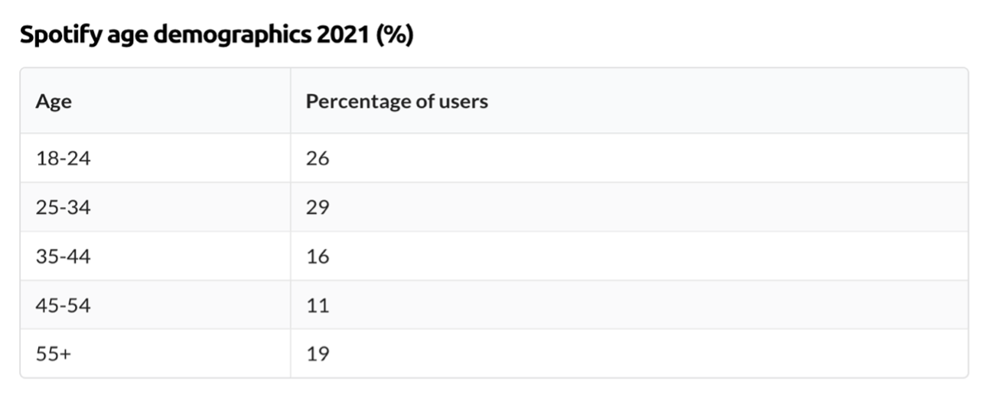

In this report, I will analyse how Spotify, “a digital music, podcast, and video service that provides users with access to millions of songs \[...] from creators all over the world” (Spotify, 2022), utilises data to strengthen its platform. To begin my research, I will provide a brief synopsis of the brand since its debut, and subsequently, its steadily increasing industry impact. I will also present the main audiences that Spotify targets and look into the different ways it uses its database to offer unique services. The purpose of this data report is to evaluate Spotify’s current performance in the market and provide suggestions on how the company could further attract consumers.

Spotify was founded in April 2006, in Stockholm by Daniel Ek and Martin Lorentzon, and has transformed music listening forever. The platform was developed to combat the problem the industry had with the illegal copying and distribution of music.[illegal copying and distributing of music](<>). Launching two years later in 2008, as an application for computers and later smartphones, Spotify allowed users of the platform to stream the service free of charge (with advertisements) with the anticipation that they would subscribe to premium with a monthly charge (ad-free).

After signing contracts with prestigious record labels, Spotify propelled into the industry by business expansion; incorporating podcasts, current news, and other audio-related features onto their platform. It’s now considered “one of the most important applications in the music industry” (History Biography, 2022), and actively interacts with its users through social media sites: Facebook, Twitter, Instagram, and TikTok (ibid).

The number of people who use Spotify worldwide has risen year-on-year, reaching 422 million active users in 2022. 2021 was a soaring year for revenue with “8.5 billion euros in premium subscription revenue and 1.2 billion euros in ad-supported revenue” (Start.io, 2022).

Typical Spotify users are young adults, millennials (29%) and Generation Z (26%), however, there is a small demographic aged over fifty-five that use the app (19%) (ibid). The platform allows these users to “discover, manage and share over 80 million tracks, including 4.7 million podcasts, for free” (Spotify, 2022), and interact with an innovative and captivating app with “no limits”. “Today, Spotify is the world’s most popular audio streaming subscription service with 456m users, including 195m subscribers, across 183 markets” (ibid). 

Spotify's main competitors are *Apple Music* and *Amazon Music*. These commercial music streaming services offer free and premium digital content from a range of record labels and artists; however, Spotify consistently remains at the top for music streaming, with 31% of global market share, followed by Apple (15%), and Amazon (13%) (Business of Apps, 2022). *Pandora* is another competitor, “but its active userbase appears to be flatlining in comparison to Spotify’s growth” (Start.io, 2022). Where Spotify reached 195 million subscribers in 2022, Pandora, otherwise, has been estimated a drop in spite of revenue growth.

Spotify’s competitive edge comes from profound machine learning technology. The platform constantly analyses consumer data, “including listening behaviours that may change during different times of the day” (AudioOxide, 2022). This differs from its competitors, which have only recently incorporated the exploitation of data metrics into their platforms.  

In the current climate, “the number of podcast listeners is large and growing” (Castos 2022). Spotify is admired for its podcasts as well as music, with its most popular podcast genre being Society and Culture. “This genre features everything from food culture, LGBTQ+ voices, and news” (The Social Shephard, 2022). With this trend rising, the number of podcast listeners is expected to reach “504.9 million in 2024” (Demand Sage 2022). One can assume that Spotify will continue to develop its platform to suit consumer needs and focus on podcasts as well as music in coming years. It will prove to be an opportunity for them to progress and reach their 55+ demographic. Since the pandemic, Spotify said during an interview with CNN that their “investments in podcasts will benefit the platform as a whole, and see an overall benefit to both usage, engagement, and retention” (CNN, 2020).

Recently, “Spotify has invested heavily in podcast content, distribution tools, and technology” (AudioOxide, 2020. With these investments, the company could continue to grow and evolve to suit other formats like audiobooks and Spotify Live. *Spotify Live* is an audio experience that lets users participate and listen to live discussions through virtual rooms and talk about the things they love with creators and fans with similar interests. It hasn’t secured avid listenership yet, but with Spotify’s data accumulating skills, this could potentially attract Spotify’s growing podcast audience.

Spotify is active on social media, with 8.7 million followers on Instagram (Instagram, 2022), 23 million on Facebook (Facebook, 2022), and 7.6 million on Twitter (Twitter, 2022). They received an average of 46.2k likes on each of their uploads on Instagram alone (Speak RJ, 2022). Though Spotify uses these platforms to its advantage when advertising, its media campaigns are what truly engages its audience to share and interact with the brand.

*“Only You” Campaign*

* *Celebrates the uniqueness of its 356 million users.*
* Evaluates its audiences behaviours through in-app experience.
* Consumers were able to see stats around their listening experience and share this information with others.
* United Spotify listeners with similar preferences.

*“Spotify Wrapped”* is Spotify’s most famous campaign, providing users with a personalised review of their listening habits for the year. It was launched on mobile apps, making it easier for users to share on social media. “In 2020, more than 90 million people chose to engage with it, and even more elected to do the same in 2021” (Rock Content, 2022). The feature offers modern businesses an insight into what successful interactive content looks like, as it is a great example of how data-powered experiences can be used not only to enhance the operation of a platform but to engage audiences too.

Overall, Spotify is a successful platform that skilfully collects and utilises audience data to improve; developing its services to benefit ever-expanding consumer needs. Spotify has set the standard for media campaigns and social media presence and could grow further if it integrates new strategies to increase its engagement rate with its mature listenership. This way it can establish a greater following and widen its outreach for maximum success. To continue as the leading platform for music streaming services, Spotify must continue to improve data collection to keep up with the competitive nature of the industry. I personally believe the future of Spotify depends on its ability to develop its Podcast and Live Spotify features.