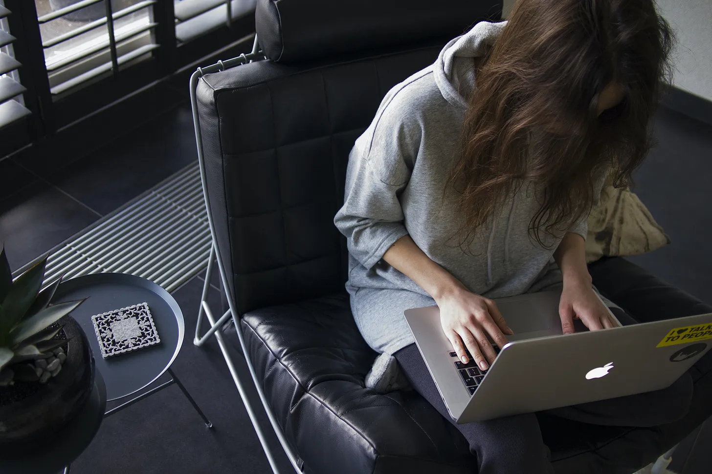
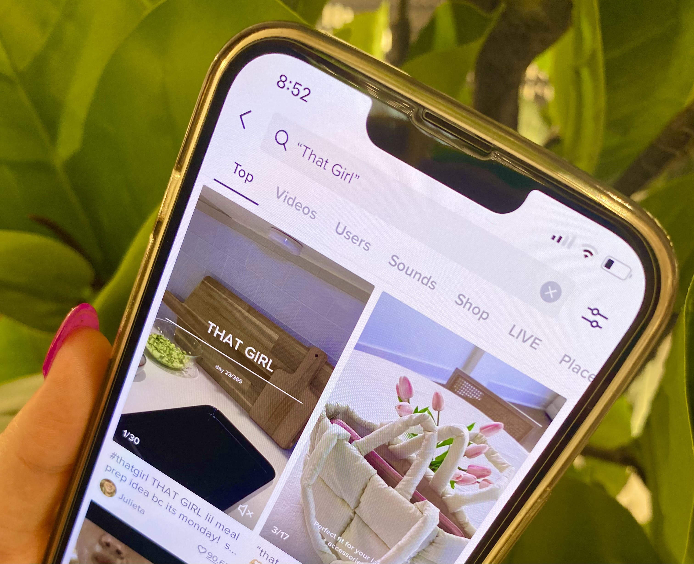

She is *that girl* - the early riser who greets the dawn with a spring in her step, makes her bed with military precision, sips on a wholesome smoothie, and sweats it out at the gym before settling into a meticulously curated journaling session. But the list doesn’t end there. Her pursuit of self-improvement extends far beyond these daily rituals, as she constantly seeks new ways to enhance her physical, mental, and emotional well-being.

Unfamiliar with the concept? *That girl* has taken the internet by storm as a wellness movement. It advocates for individuals to embody their finest selves by taking control of their lives and presenting themselves attractively. In essence, it’s about looking and feeling your absolute best.

Now, with over [11.7 billion views](https://www.tiktok.com/tag/thatgirl?lang=en) on TikTok alone, an increasing number of women are starting to share their self-betterment routines. From perfectly plated meals to coordinated workout ensembles, social media feeds are flooded with aesthetically pleasing visuals, and the trend shows no signs of slowing down.

<iframe width="560" height="315" src="https://www.youtube.com/embed/https://youtu.be/ZpcGjvpAZow?rel=0" allow="accelerometer; autoplay; encrypted-media; gyroscope; picture-in-picture" allowfullscreen></iframe>

First appearing on feeds back in April 2021, the *that girl* trend seemed relatively tame compared to the likes of the daring [‘vabbing’](https://www.allure.com/story/vabbing-tiktok-trend-explained#:~:text=A%20little%20perfume%2C%20of%20course,help%20you%20attract%20a%20partner.) craze - (for the brave souls out there, feel free to Google it). However, with the onset of the new year and the common resolution to prioritise mental and physical health, the trend has surged in popularity.

> *“When trends gain attention and go viral, their intended message tends to get lost or tampered with,”* argues a second year student at Oxford Brookes University.

At first glance, the *that girl* phenomenon appears harmless. After all, what’s so wrong with girls inspiring girls to strive for better? A closer look reveals that just like every other social media trend, *that girl* has received a fair amount of criticism.  

The trend is believed to be having a negative impact on women beyond social comparison. Beneath the visually appealing facade, lies issues that are often overlooked. The pressure to maintain a perfect appearance has led to under-eating and workaholism, as girls strive to meet the unrealistic standards set by social media influencers. This, in turn, has resulted in a distorted view of health, which can lead to struggles with self-esteem and body image.

*‘I’ve heard of girls developing full-blown eating disorders because they follow the same eating habits of these influencers that have entirely different body shapes and proportions,’* says Emily 22, from Leicester, who participated in the trend last year.

Emily then admitted that she also fell for it for a while, which resulted in her accidentally undereating and subsequently having a lack of energy.

> *‘It promotes a picture-perfect life that just doesn’t exist, everyone is different. Life isn’t one-size-fits-all.’*

Some of the women in these TikTok videos (and now on other social media platforms like [Pinterest](https://www.pinterest.co.uk/search/pins/?rs=ac&len=2&q=that%20girl%20aesthetic&eq=that%20girl&etslf=3847), [YouTube](https://www.youtube.com/results?search_query=that+girl+aesthetic), and [Instagram](https://www.instagram.com/explore/tags/thatgirl/) are promoting under-eating as desirable. They proudly showcase their eating habits and claim that a typical day for them involves consuming only a small bowl of porridge for breakfast, a piece of fruit for a midday snack, and salad for tea.

Though every individual varies, [specialists](https://www.nhs.uk/common-health-questions/food-and-diet/what-should-my-daily-intake-of-calories-be/) recommend women have a daily intake of 2000 calories. Which ultimately raises questions about the impact the *that girl* trend can have on impressionable viewers, particularly those vulnerable to developing eating disorders.

On some level, the strive for ‘perfection’ is a universal human experience. With the rise of trends that promote ‘girl boss’ energy, it’s understandable for women to want to follow a movement designed to help them achieve financial independence, career success, as well a productive mindset. But where do we draw the line?

*That girl* has been accused of glorifying workaholism and setting unrealistic standards for success. As a primarily young viewership, this TikTok audience may feel pressure to conform to societal expectations set by influencers who mask potential burnout with a filter.

Promoting the *that girl* ethos that involves toxic productivity may be counterproductive, warn [therapists who want to shut down the trend](https://www.humnutrition.com/blog/that-girl/). Even a study conducted by University College London has highlighted a link between [long working hours and increased risk of cardiovascular disease](http://www.thelancet.com/journals/lancet/article/PIIS0140-6736(15)60295-1/fulltext), indicating that the trend's culture of workaholism may ultimately lead to negative health outcomes.

Olivia Eve Shabo, founder and host of the ‘For You From Eve’ podcast, has accumulated a significant following of [50k on TikTok](https://www.tiktok.com/@foryoufromeve?lang=en), where she uploads a variety of lifestyle content. From vlogs to workout routines, motivational videos and healthy diet tips, Olivia’s videos encourage her viewers to become better versions of themselves. But instead of promoting hustle culture, she actively maintains that “[that girl has no expectations](https://www.tiktok.com/@foryoufromeve/video/7057607517752560943?_r=1&_t=8bUjfsBHSV0)”.

> ‘It’s important as an influencer to relay the importance of self-love and self-care. If you’re going to follow trends, there needs to be balance,’ she says.

Olivia’s message has resonated with her followers, who appreciate her authentic and realistic approach to personal growth. Her success highlights the growing demand for content creators who promote healthy lifestyles without endorsing harmful behaviour.

The idea of constant self-improvement is deeply ingrained in our society: with the expectation that we should strive to eat healthier, work out more, and take better care of our skin. Moreover, there's a cultural pressure to display our efforts towards self-improvement to others, fuelling the belief that there's always room for more progress.

Emily gives the best advice to young girls looking to participate in the trend:

> *‘Remember to keep in mind that this is a fad. If you choose to take part in the trend, make sure you remain in control rather than letting it control you. You can include elements of the trend without it dominating your life by adapting it to suit your needs.’*

Amidst the societal pressure to follow the latest trends or wellness standards, prioritise striving for emotional balance and a healthier lifestyle. Instead of punishing yourself for indulging in small pleasures like having a lazy Sunday or squeezing a few extra drops of syrup on your overnight oats, see it as a treat. Even though these actions may go unnoticed by others, they are cherished as a means of finding inner peace amidst the chaos of daily life.

She is *that girl* for a reason, and you're you for a reason. Celebrate your individuality.

