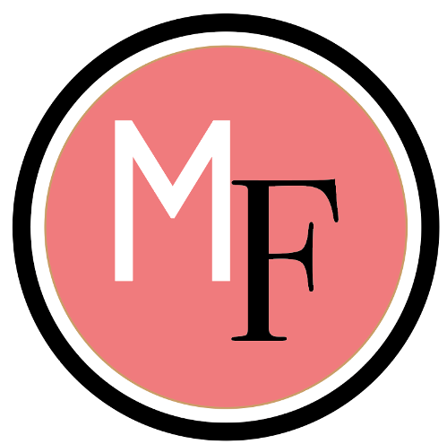

Welcome to MeghaFont! A blog devoted to analysing typography and how it's used in print media. The articles posted will be insightful and educational and give you readers a chance to learn something new.

What I'll be analysing:

* Book Publishing 
* Magazine Editing
* Newspaper Editing
* Advertising

***My Logo***

The reason behind the design aspect for my logo was to appropriately translate the general feel for my blog. It's simple and incorporates both sans serif and serif fonts which is a major part of typography. Since the topic I've decided to cover is predominantly based around print media, I thought the blend of the two font types would work well in accurately translating my brands image. 

I placed the M (Megha) and the F (Font) slightly spaced apart in the middle of open newspaper to accurately represent the idea of print media and the physicality of it. I chose a white font to stand out against the pink background. 

***My Cover Picture***

My cover picture is a still image of a magazine being printed and this ties into the theme of my blog and the articles I'll be posting. Magazines are one of the most popular forms of print media and once readers are directed to my site, they will be immediately know the intent of my website.

